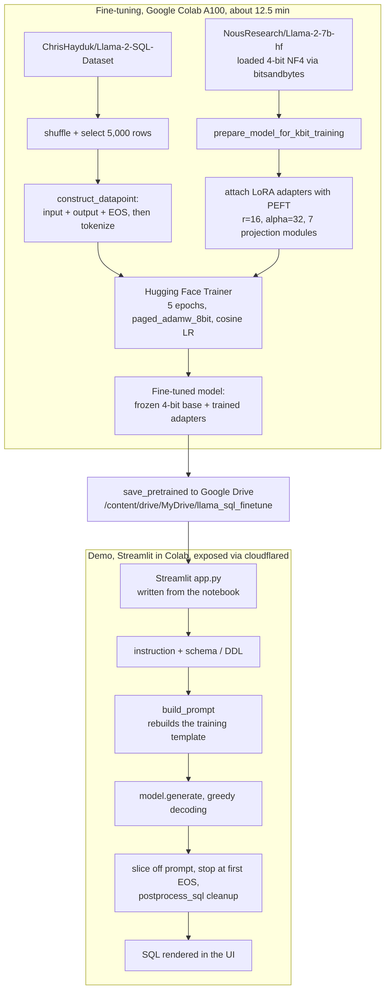

# English-to-SQL with Llama 2

Fine-tuning Llama-2-7B with LoRA and 4-bit quantization to turn a plain-English question plus a table schema into a SQL query — trained end to end on a single Colab GPU.

<p align="center">
  
  
  
  
  
  
  
  
  
  
</p>

<p align="center">
  <a href="https://colab.research.google.com/github/srikara202/llama-2-SQL-Query-Generator/blob/main/llama_fine_tuning_SQL_query_Bot.ipynb">
    
  </a>
</p>

## What it is

You give the model an English request ("Return the season where points are greater than 21 and finish is '6th north'") and the schema of the table it should query (`CREATE TABLE table_name_18 (...)`). It writes the SQL.

The interesting part is not the output, it is the budget. A 7B-parameter model does not fit comfortably in a free-tier-style GPU when you also need optimizer state and gradients. So instead of full fine-tuning, the base weights are loaded in 4-bit and frozen, and only small LoRA adapter matrices are trained on top — the QLoRA recipe (4-bit NF4 base, LoRA adapters, paged 8-bit optimizer). That is what makes the whole loop — train, evaluate, save, serve — fit inside one Colab session.

This is a learning and portfolio project, built to work the full lifecycle of an LLM fine-tune rather than to ship a production text-to-SQL service. It is schema-aware prompting over pasted DDL, not a database agent: the model never connects to or inspects a live database, and it does not execute the SQL it writes. The scope is deliberate, and the [Limitations](#limitations--next-steps) section says exactly where it stops.

## Demo

The notebook writes a Streamlit app from inside Colab and exposes it through a `cloudflared` tunnel. Two text boxes (instruction, schema), one generated query.


<!--
  Optional: a short screen recording is more convincing than stills.
  Drop a file at docs/demo.gif and this line will render it. Until then it shows
  a broken image, so either record it (see README handoff) or delete this block.
-->


## Architecture



Everything lives in one notebook, [`llama_fine_tuning_SQL_query_Bot.ipynb`](llama_fine_tuning_SQL_query_Bot.ipynb). It installs dependencies, loads the dataset, loads and quantizes the base model, attaches adapters, trains, runs an inference check, persists to Drive, and then generates and serves the Streamlit demo.

## What this demonstrates

Mapped to the work an AI/ML engineer actually does, not adjectives:

- **Parameter-efficient fine-tuning under a hard memory budget.** Loading Llama-2-7B in 4-bit NF4 (bitsandbytes) and training LoRA adapters (PEFT) on the attention and MLP projections, with a paged 8-bit optimizer — the QLoRA approach — so a 7B model trains on one GPU instead of needing a multi-GPU box.
- **Instruction-style data prep for causal LM.** Each row becomes a single `input + output + <eos>` continuation; the model learns to produce SQL after a structured prompt rather than being trained with masked-LM objectives.
- **Train/inference prompt alignment.** The demo's `build_prompt` reconstructs the exact template the model was trained on (`### Instruction` / `### Input` / `### Response`). Fine-tuned models drift when inference prompts don't match the training distribution; this keeps them matched.
- **Generation-time handling that demos usually skip.** `generate` returns prompt + continuation, so the code slices the prompt tokens off, hard-stops at the first EOS, and post-processes the text — stripping code fences and cutting the output the moment the model starts hallucinating the *next* example's headers.
- **From notebook to something clickable.** Model persistence to Drive, a dtype-configurable loader cached with `@st.cache_resource`, and a Streamlit UI tunneled out of Colab — the unglamorous glue that turns an experiment into a demo.
- **Honest scoping.** Knowing that exact-match is a weak SQL metric, that schema-aware prompting is not database introspection, and what a production version would actually need.

## Key decisions and tradeoffs

**LoRA instead of full fine-tuning, 4-bit instead of fp16.** The binding constraint was fitting 7B training into Colab. Full fine-tuning means optimizer state and gradients for all ~7B parameters. LoRA trains roughly 40M adapter parameters — about 0.6% of the model — and leaves the rest frozen. Loading those frozen weights in 4-bit NF4 with float16 compute cuts the memory they occupy. The two are complementary: quantization makes the model *fit*, LoRA makes adaptation *cheap*. The cost is that 4-bit base weights are lossy and LoRA has less capacity than a full update — an acceptable trade for this task and this hardware.

**Adapters on both attention and MLP projections.** LoRA targets `q_proj`, `k_proj`, `v_proj`, `o_proj` (how the model attends) *and* `gate_proj`, `up_proj`, `down_proj` (how it transforms features). Covering both gives the adapters enough reach to shift behavior toward SQL without touching the base weights.

**A 5,000-row subset.** The dataset is larger; the notebook shuffles the train split and takes 5,000 examples. For demonstrating task adaptation on a fixed time budget, a few thousand well-formed examples are enough to move the model, and the run stays short (see [Results](#results)).

**`NousResearch/Llama-2-7b-hf`.** A community mirror of Llama-2-7B that loads through the standard `transformers` API without the gated-access handshake, which keeps the notebook reproducible for anyone who opens it.

**Exact-match as a sanity check, not a grade.** The notebook compares one generated query against the dataset's reference string. That is fine as a smoke test and honest about being one — the same query can be written many correct ways, so string equality understates real accuracy. Proper evaluation would run the SQL and compare result sets.

## Results

This is a small fine-tune with a deliberately light evaluation. The real numbers, no inflation:

| Metric | Value |
|---|---|
| Training run | 5 epochs over 5,000 examples, effective batch size 4 (batch 1 × grad-accum 4), about 6,250 optimizer steps |
| Wall-clock | 12 min 35 s on a Colab A100 |
| Trainable parameters | ~40M LoRA params, ~0.6% of the 7B base (the rest frozen in 4-bit) |
| Optimizer / schedule | `paged_adamw_8bit`, cosine LR, `lr=3e-5`, `warmup_ratio=0.05`, fp16 |
| Inference latency | ~8.5 s per query in the demo (A100) |

On quality: I hand-checked 12 prompts spanning easy to harder queries, and all 12 produced SQL I judged correct, in addition to the notebook's single exact-match check against a held-out `eval` row. That is a manual spot-check, not a benchmark — there is no execution-based evaluation here, and I would not claim a correctness percentage from it. The two screenshots above are real outputs from those checks.

## Tech stack

| Layer | Tools |
|---|---|
| Model | `NousResearch/Llama-2-7b-hf` (base), LoRA adapters |
| Training | PyTorch, Hugging Face Transformers (`Trainer`), Datasets, PEFT, bitsandbytes, Accelerate |
| Data | `ChrisHayduk/Llama-2-SQL-Dataset` |
| Demo | Streamlit, generated from the notebook and tunneled with `cloudflared` |
| Runtime | Google Colab (A100), Google Drive for artifact storage |

`requirements.txt` also lists `trl`; the committed training loop uses `transformers.Trainer` directly, so `trl` is installed but not exercised. `streamlit` is installed in the notebook's demo section rather than in `requirements.txt`.

## How to run

The project is built for Colab, not for a local box — a 7B model in 4-bit still needs a capable GPU.

1. Open the notebook in Colab with the badge above, or upload [`llama_fine_tuning_SQL_query_Bot.ipynb`](llama_fine_tuning_SQL_query_Bot.ipynb) yourself.
2. Set the runtime to a GPU (an A100-class GPU was used here).
3. Run the cells top to bottom: install, load dataset, load and quantize the model, configure LoRA, train, run the inference check.
4. Mount Google Drive and run the save cell to persist the model and tokenizer.
5. Run the demo section to write `app.py`, start Streamlit, and open the `cloudflared` URL.

For a local dependency install of the training libraries:

```bash
pip install -r requirements.txt
```

Note that `app.py` is not checked in — it is generated at runtime by a `%%writefile` cell, so it only exists after you run the demo section in Colab.

## Limitations and next steps

Where it stops, and what I would build next.

- **No execution, no live schema.** The model sees only the DDL pasted into the prompt. It does not connect to a database, introspect real metadata, or run the SQL it writes. Next: schema retrieval instead of manual paste, and execution-based evaluation that compares result sets rather than strings.
- **Thin evaluation.** One exact-match check plus 12 manual generations. Next: a held-out suite scored by execution against known schemas.
- **No guardrails.** No SQL parsing, no validation that referenced tables and columns exist, no query-type restrictions, no auth, no observability. These are the first things a real deployment would need before any generated query touched data.
- **Notebook-first structure.** The app is generated at runtime, dependencies are unpinned, and there are no tests or CI. Next: split training, inference, prompt-building, and UI into modules with a checked-in entrypoint and pinned versions.
- **Artifact reload.** Persistence saves the LoRA checkpoint with `save_pretrained`, but the demo screenshots were produced from the in-memory model right after training. Reloading cleanly outside the training session means merging the adapters (`merge_and_unload`) or loading them adapter-aware (`PeftModel.from_pretrained`) rather than calling `AutoModelForCausalLM` on the adapter folder.
- **SQL realities.** Output can drift on long or ambiguous schemas, the dialect is whatever the data taught, and aggregate conditions (`HAVING` over a computed average vs. a row-level `WHERE`) are exactly the kind of thing a small fine-tune gets subtly wrong.

The notebook also carries commented-out scaffolding for pushing the model and a Streamlit Space to the Hugging Face Hub — a starting point, not a finished path.

## License

MIT — see [LICENSE](LICENSE).

## Acknowledgments

Base model `NousResearch/Llama-2-7b-hf`; dataset `ChrisHayduk/Llama-2-SQL-Dataset`; built with Hugging Face Transformers, PEFT, bitsandbytes, and Streamlit.
